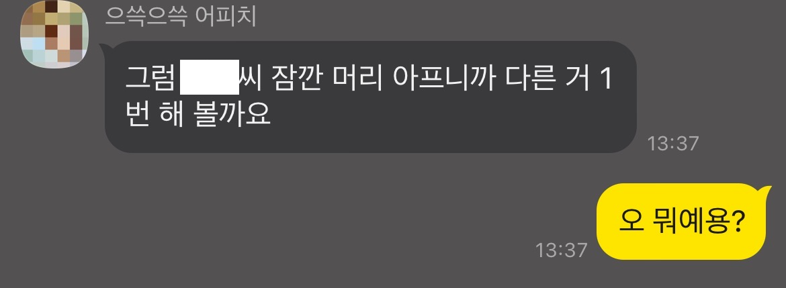

9월 말부터 지금까지 길고 길었던 번아웃 기간이었다.

학업과 일을 병행하면서부터 몸과 마음이 점차 지쳐갔고, 사람을 만나는 것조차도 귀찮았다.

침대에서 한 발자국도 안 나가고 유튜브 알고리즘을 따라 시간을 버리는 것이 내 일상이 되었고, 그에 따라 내가 해야 할 것조차 미루면서 미룬 일들이 쌓이고 쌓여 눈덩이처럼 불어났다.

데드라인이 임박해지고, 학업에도 지장이 가버리니 일상이 아예 망가져 이전의 일상으로 못 돌아갈 것 같았다.

그래서 11월 초에 친구들을 만나기 시작했다. 원래 같으면 바쁘다고, 귀찮다고 흘러 보냈을 약속인데 그날따라 가보고 싶어 졌다.

그렇게 그날 나는 숙취로 찌들어 하루 종일 침대 신세를 지게 되었다. 유튜브도 연락도 안 보고 20시간 넘게 잠만 잤다.

잠들다 중간에 깨서 이게 뭐 하는 건가 싶었다. 내가 이러려고 사는 게 아닌데 하면서.

그러다가 내가 지금까지 미뤘던 일들이 생각나면서 그동안 내가 왜 미뤘을까, 피해 다녔을까를 깊게 생각하기 시작했다.

생각해보니 내가 학업도 AI 공부한답시고 4 전공 코딩 과목에, 외주 일도 코딩에, 취미도 코딩인 말 그대로 코딩 빼면 시체나 다를 바 없는 상태였더라.

거기다 내가 좋아하는 코딩만 하는 거면 몰라도 중간중간에 진짜 싫어하는 걸 떠나서 쳐다보기만 해도 기 빨리는 '프론트' 코드를 작성해야 하는 상황도 껴있었고... 그래서 코딩을 기피하다 보니 할게 없어져서 사람이 무기력해졌나 보다.

아무튼 그래서 그날 이후로 코딩과 내 삶의 경계를 분리하기 시작했다.

새로운 취미도 찾았다. 새로운 사람 찾아 떠나기. 꾸준한 운동. 드라이브.

할 일 끝나면 그 이후로 코드를 안 쳐다보는 삶을 처음으로 실행했다.

그리고 일적으로 불가피하게 프런트 코드를 작성할 일이 생기니 힘들다, 솔직하게 대표님께 말씀드렸다.

~~직무유기 장인~~

대표님이 이 글을 볼 일이 있을까 싶지만 이해해주셔서 정말 감사하다...!

~~충성 노예 1호~~

내가 프론트 코드로 인해 고통받고 있으니, 다른 거 한번 해보시라 제안을 해주셨다. 저 날 1시간 컷 냈더라... 내가 집중을 잘 안 하는데, 한번 집중하는 순간 그 누구보다 빨리 끝낼 수 있다고 자신하는데, 이때 유독 그게 더 발휘된 것 같았다.

아무튼... 지금은 다시 코딩이 재미있어졌다. 옛날 번아웃은 짧게 오고 그랬는데 이번에 긴 번아웃 기간을 거친 만큼, 다시 이런 번아웃이 오지 않게 예방책을 잘 세우고 그대로 살아야겠다 느낀 11월 중순이었다.

일단 첫 번째, 생활 패턴 맞추기. 코딩하다 보면 밤샐 때가 종종 있는데, 되도록이면 자제하려고 한다. 지금도 거울 보면 얼굴에 다크서클이 가득하다...

두 번째, 사람 좀 만나기. 난 INTP라 사람들을 만나면 기가 빨려서 집에 혼자 있는 걸 선호하는 편인데, 이번 기회에 새로운 사람을 만나고, 이야기하고 다니다 보니 그들에게서 배울 점도 있더라. 물론 기가 빨리는 건 동일하지만 그래도 사람은 사회적 동물이니깐... 적당히 조절해야지

세 번째, 코딩 외 취미 들이기. 난 이걸 운동으로 들여보려고 한다. 내가 저체중인데, 일단 10Kg 만 건강하게 찌웠으면 좋겠다. 내년 여름 때 상의 탈의하고 수영해보게.

아무튼 내가 미뤄왔던 일들을 다시 땜빵해야 하고 그러느라 당분간 정신없겠지만 일단 코딩이 재미있어졌고, 하고 싶어 졌으니 번아웃은 탈출한 것 같다.
