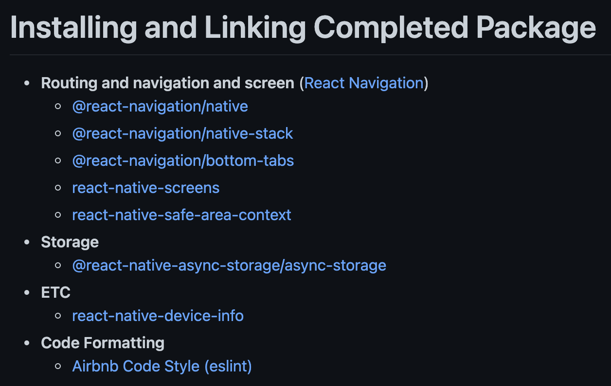
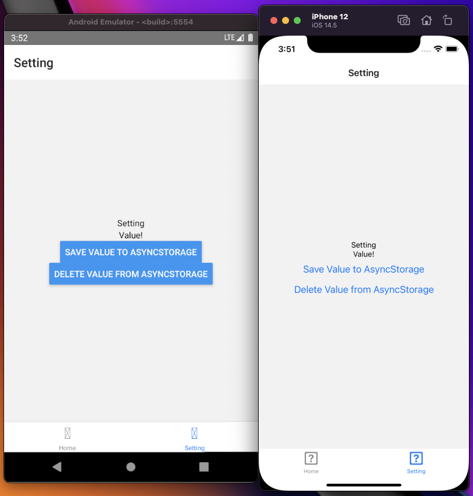
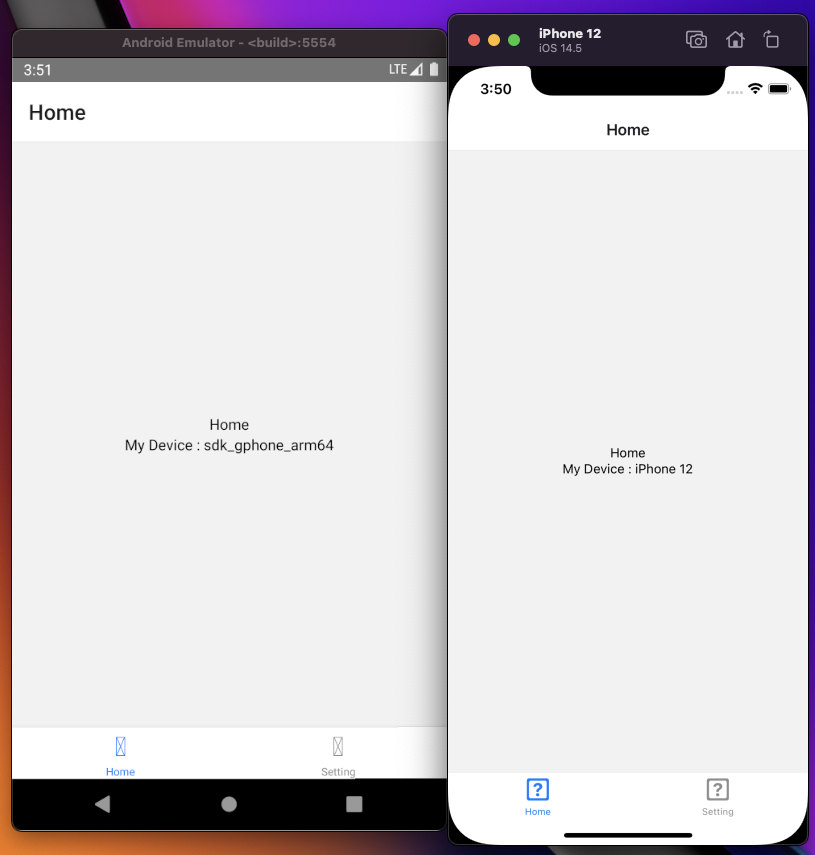

RN에 입문한 지 얼마 안 됐지만, 엄청 재미를 느껴서 토이 프로젝트도 하고, 커뮤니티에 들어가 거의 상주하다시피 하고 그러고 있다.

npx react-native init를 통해 여러 번 프로젝트를 만들다 보니 똑같은 패턴, 똑같은 코드 작업이 보여 이를 더 이상 하지 말자 마음먹고 자주 쓰는 패키지만 담아 보일러 플레이트화 시켰다.

https://github.com/TimeTREE98/react-native-boilerplate

Async Storage, Navigation (Bottom-Tabs) 라이브러리는 안쓸래야 안 쓸 수 없는 존재이기 때문에, 아예 넣어놨으며 ETC의 경우 그냥 지금 내가 쓰고 있어서 넣어놨다. (나중에 'yarn remove react-native-device-info' 해도 의존 문제는 안 생긴다.)

airbnb code formatter eslint 세팅도 해놨고.. 아마 내가 신규 RN 작업을 한다면 처음부터 할 필요 없이 풀 받아와 바로 작업해도 될 듯하다.

샘플 코드로 하단 탭, 디바이스 모델명 갖고 오기, asyncStorage 활용 데이터 저장을 작성해놓았으니 초보자분이 보고 참고해도 좋을 것 같다.
