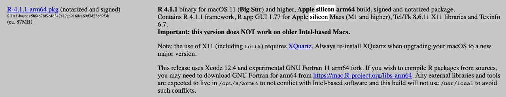
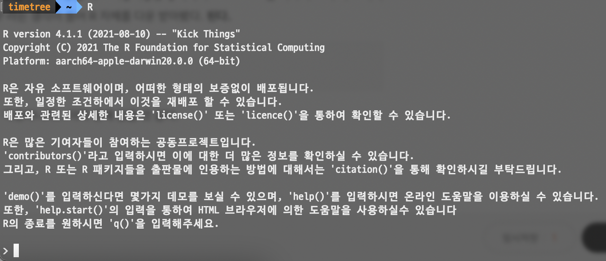
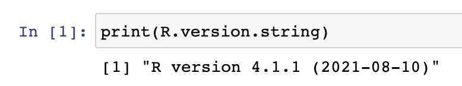

## 주절주절

m1 Macbook 을 산지 한 달이 넘었다. 전에 쓰던 게 2018년식 Intel i7-9750H, 16GB RAM, 라데온 555X Macbook Pro 였는데, 전에 쓰던 거보다 150만 원이나 저렴하면서 중고가 100만 원도 안 되는 m1 기본형 Macbook Air 이 더 좋은 거 같다.

지금까지 그래 왔던 것처럼 ARM 데스크톱 시장을 애플이 주도하려는 움직임이 보여 가슴이 웅장해진다...

하지만 x86 데스크톱에서 급작스럽게 ARM으로 전환하니 x86에서 잘 돌아갔던 프로그램들이 호환 안 되는 이슈가 발생한다.

그래도 각 분야의 엔지니어들이 발 빠르게 ARM 대응을 지원해줘서 내가 주로 개발하는 node, python, docker,... 등은 별 무리 없이 사용 가능하다...!

아무튼 본론으로 들어가서 이번 대학교 수업으로 '빅데이터 분석' 이란 수업을 듣게 되었는데 이 수업 설명이 아래와 같이 되어있었다.

> Jupyter Notebook 환경하에서 SQL, Python과 pandas, sk-learn 등의 Python package들, 그리고 R 등의 도구를 이해하고 활용하는 실습 위주의 교과목

교수님께서 제공해주신 가이드 문서에 conda 패키지 관리 도구로 r-essentials를 받고, jupyter notebook을 구동하면 된다고 적혀있었다. 원래 내가 python 개발 환경 관리는 virtualenv를 사용해왔는데, 이번 수업에선 'Jupyter Notebook'이라는 개발 도구와 R 등의 도구를 사용한다 해서 일단 따라 했다.

m1 Macbook은 anaconda를 native로 지원하지 않는다.
처음 난관에 부딪혔다. rosetta를 통해 pkg를 설치하면 어찌 되긴 할 꺼같은데, 안 그래도 연산이 중요한 빅데이터 처리에서 native를 버리고 10% 성능 떨어지는 rosetta를 써서 구동을 해야 하나? 싶은 생각이 들었다. 정보를 찾아봤다.

https://github.com/conda-forge/miniforge

여러 정보를 찾아보면 ARM을 native로 지원하는 것은 miniforge라고 되어있다. 'anaconda를 설치해서 용량 1GB 넘게 잡아먹힐 바에 내가 직접 패키지는 깔 테니 용량 적은 걸로 설치하고 대신 나중에 패키지 설치는 내가 직접 할게'라는 정신 승리를 바탕으로 miniforge를 설치해주자.

다양한 설치 방법이 있지만 우리 Macbook 유저들은 brew라는 강력한 패키지 관리 도구가 있다. 안 쓴다면 검색해서라도 꼭 쓰자.

```bash
brew install miniforge
```

끝. conda가 설치되었다. 간단하다.

conda 가상 환경 설정하고 R 받기
위 brew를 통해 miniforge를 받았다면, terminal에서 conda 명령어를 사용할 수 있을 것이다.

그래서 교수님 가이드 문서대로 따라 해 봤다.

```bash
conda create -n myR -c r r-essentials
```

안된다. 아무리 죽어라 해도 r-essentials가 안 먹힌다. R 언어가 ARM을 지원 안 하나? 싶어서 R 공식 사이트를 찾아봤는데, 4.1부터 지원을 한다고 되어있었다.

저기 pkg를 받아서 설치해도 되긴 한다. 하지만 그러자니 내가 위에서 miniforge를 애써 받아놨는데, 무색해지는 건 싫다. 또 앞으로 R 관련 패키지 오류가 날 수 있는데, 가상 환경이 아닌 로컬에 R을 설치한다는 건 내 성향과 맞지 않는다. conda 명령어를 검색해봤다. r 채널이 conda-forge로 합쳐졌다고 한다. 그래서 'conda create -n myR -c conda-forge r-essentials'로 해주면 된다.

근데 또 안된다. r-essentials install fail 관련 키워드 찾아다녔는데 왜 안될까. 결국 밤을 새우고 비몽사몽 한 상태에서 essentials는 어차피 R의 서브 패키지일 뿐이니까... R 자체를 다운받아버리면 되는 거 아니야?라는 생각이 들어 R 자체를 다운 받아봤다. 된다.

```bash
conda create -n myR -c conda-forge r
```


교수님 가이드 문서랑 어째 달라지긴 했지만, R 치면 작동하니까... 아마 문제없을 것 같다.

### conda 에 jupyter notebook 설치하고 R 연동하기

```bash
conda activate myR  # R 설치한 가상 환경 활성화

## R 이 설치된 conda env 환경에 jupyter 을 설치하고자 할 때
conda install -c conda-forge jupyter  # jupyter 설치
## or
## R 만 설치하고 외부 jupyter에서 R 커널을 사용하고자 할 때
conda install -c conda-forge ipykernel  # ipykernel 설치

R  # R 커맨드 입장
R > install.packages(c('repr', 'IRdisplay', 'IRkernel'), type = 'source')  # R 패키지 설치
R > IRkernel::installspec()  # R 패키지 IRkernel 으로 jupter kernel 등록 처리
R > q()
```

이후 jupyter notebook 구동하고 커널을 확인해보면 R 이 들어가 있다!

이렇게 jupyter 설치와 R 설치까지 마무리되었다.

m1 Macbook 주인으로 살아간다는 건 참 피곤한 거 같다.
