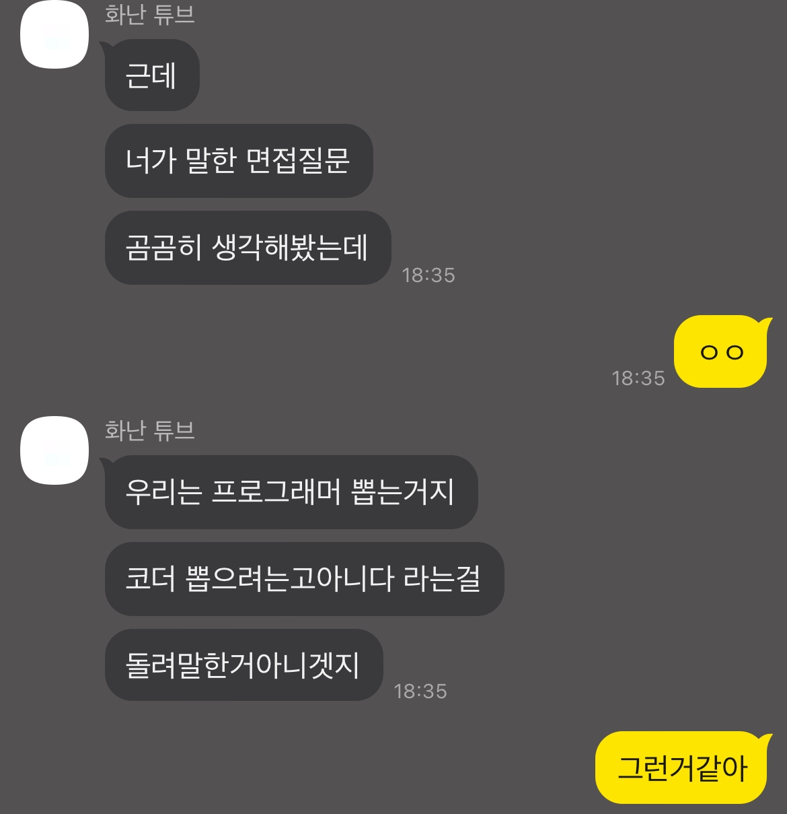

결과만 말하자면 해부 당한 느낌이라고 해야하나.

내가 가진 3년이라는 경력이 그저 '물'이구나를 느끼게 되었다.

3년 전, 개발에 흥미를 크게 느껴 독학으로 시작해 혼자 개발하던 도중 ~~근거 없는~~ 자신감이 붙어 외주를 받고, 그 외주 때문에 어느 회사에서 재택근무 직원으로 일해보지 않겠냐는 제안을 받아 일한 지 약 2년이 지났다.

그 와중 스타트업에 관심이 많아 여러 곳 다녀보기도 했다. 하지만 처음 시작하는 대부분의 스타트업이 그렇듯, 항상 망했다.

그러다 22년 1월, NFT 시장이 엄청나게 떠오름에 따라 친한 스타트업 멤버들이 NFT Analytics 플랫폼을 만들면 어떠겠냐~ 는 제안을 했고 그 당시 나도 블록체인에 관심이 많은 터라 자연스럽게 동참하게 되었다.

8개월이라는 제작 기간이 걸렸고, 결과적으론 망했다. 이것도 이야기가 긴데, 이 부분은 나중에 시간 내서 한번 글로 정리해야겠다.

그래서 서비스를 종료하는 날 같이 작업했던 팀원들과 함께 술자리를 갖게 되었다.

술에 취한 채, 8개월이라는 기간 동안 무보수로 일했다는 사실보다 내가 만든 것을 사람들이 제대로 사용하기도 전에 닫게 되었다는 사실에 억울하여, 평소 봐왔던 규모 있는 스타트업에 내가 이러한 것을 했는데, 오픈 못해서 억울하다, 그 한을 여기서 풀고 싶다는 등 나를 뽑아달라라는 장문의 메일을 보냈다. ~~지금 메일 다시 보니 왜 보냈지 싶다.~~

그렇게 약 5일이 지난 후, 해당 스타트업의 부사장님이 내일 한번 밥 먹으면서 이야기해보지 않겠냐는 제안을 하셨다.

이 글을 작성하는 기준으로 대학교 3학년인데, 솔직히 어제까지의 나는 이렇게 생각했다.

'대학교에서 뭘 배우냐...? 졸업한다고 해서 회사 들어가서 바로 쓰지도 못하는데, 차라리 몸으로 부딫혀가면서 배우는 게 빠르고, 기억에 깊이 남지 않을까?'

그래서 흔쾌히 해당 회사의 채용 프로세스를 시작하게 되었는데, 그 프로세스 중에 코딩 테스트 대신 수행하는 과제가 있었다.

FastAPI 로 API 를 구현하는 과제였는데, 나는 FastAPI 프레임워크를 크롤러, 부하가 큰 작업 외엔 경험이 없어 해당 프레임워크의 개념이 잘 잡혀있지 않아 github에서 참고할만한 코드를 찾아보고, 그 코드를 베이스로 작업을 다하여 제출했다. ~~이때 죄송하다 하고 빤쓰런 쳤어야했나...?~~

그렇게 과제를 제출한 후 월요일 or 목요일 직무 면접을 진행할 건데, 어느 날이 편하냐는 연락이 왔었다.

원래 내 계획은 직무 면접이기에 미리 공부 좀 해가야지 생각이였는데, 구글에 아무리 검색해도 그 회사에 대한 면접 후기 및 자료가 없어 그냥 매도 먼저 맞는게 낫다 생각하고 제일 빠른 월요일로 지원했다.

그렇게 오늘 면접을 보게 되었고 이 글을 쓰는 지금, 멘탈이 나가버렸다.

~~면접 결과는 안나왔지만 아마 떨어질 거 같다.~~

원래 어떤 거든 개발 할 수 있다, 라는 자신감을 가지고 있었는데 지금은 음... 자신감이 제로가 되다 못해 지하 1층, 5층, 100층까지 뚫고 내려가는 기분이라 해야하나 아무튼 그렇다.

그래도 이번 면접을 계기로 내가 부족했던 점, 내가 가지고 있던 개발 접근 방법의 고칠 점을 깨닫게 되었으니 이걸 계기로 단순 코더가 아닌 프로그래머가 되어야겠다 라 생각해 복기하고자 이 글을 쓰게 되었다.

면접 질문 및 이야기 리스트 (생각나는대로 시간 순서대로 배치 했는데 틀릴 수 있다.)

큰 틀에서 '과제 리뷰', '백엔드', 'DB', '상황 시나리오', '기본 지식', '업무 관련', '기타'로 나누었다.

그리고 내가 생각하는 기준에 대해 괜찮게 답변했다 생각하는 것은 O, 애매하게 답변 했던 것은 △, 아예 대답을 못했던 것나, 틀린 것은 X 로 표기한다.

- 과제 리뷰 (과제 리뷰 시작부터 내가 FastAPI 경험이 별로 없어, github 에서 베이스코드를 참고했다고 먼저 말했다.)
  - △ 수행했던 과제에 대한 설명을 해달라
  - △ 스케쥴러 파트를 개선한다면 어떻게 개선할 것인가? (서버가 2대 4대로 늘어날 경우 스케줄된 작업은 한곳에서 처리되어야하기에)
  - △ 라우터와 서비스를 나누었다 왜 나눴는가?
  - △ 서비스에서 비즈니스 로직을 처리한다 하였는데, 왜 이 라우터에서는 비즈니스 로직을 서비스에서 처리 안하고 라우터에서 처리했는가?
- 백엔드
  - △ DAO, DTO 개념이란?
  - X GraphQL의 장단점은? (이때 소켓 사용이 간단하다, 하면서 Subscriptions 를 예시로 들며 말하였는데, 오늘 알고 보니 그건 라이브러리 기능이였다...)
- DB
  - O NoSQL, SQL 차이점은?
  - △ ORM을 자주 쓴다고 했다. 왜 자주 쓰는가?
  - △ ORM의 장단점은?
  - X SQL 인덱스에 대해서 어떤 게 있는가?
  - X B-tree 인덱스는 어떤 방식으로 동작하는가?
- 상황 시나리오
  - △ 당신이라면 NoSQL은 어떤 상황에 쓸 것인가?
  - X 당장 1천억건이 들어온다 당신이라면게 할 것인가? (이때, 나눠서 쪼개 저장하는 파티셔닝으로 대답하였는데 극단적인 예시로 하루 안이라고 추가 질문 들어옴)
  - O MSA에서 API가 느리다고 한다 당신이라면게 할 것인가?
  - △ 당신이라면 MA에서 MSA로 이전하는 시기를 언제로 잡을 것인가?
  - △ API 초당 호출 제한을 걸려고 한다 당신이라면게 할 것인가? (이때, 1천만건의 요청을 예시로 들어 확장 방안 추가 질문 들어옴)
  - O 긴급한 요청으로 인해 API를 급하게 만들 수 있다. 이럴 때 당신은 코드 퀄리티 등 밸런스를 어떻게 맞추는가?
  - O CI CD 단계가 없다면 어떤 문제가 발생하는가?
- 기본 지식
  - △ NodeJS와 Python 언어의 장단점
  - X Process와 Thread의 차이점 (동작 방식)
  - X Java, Kotlin 등 다른 언어에 대해 들어봤을 것 같은데, 각각의 장단점이 뭐가 있는가?
  - X Goroutine은 어떻게 동작하는가? (Go언어)
  - X 메모리에서 Stack, Heap 차이점
  - X NodeJS에서 process 처리 차이점 (코드)
  - O MA, MSA 아키텍쳐 장단점
  - O CI CD 설명해달라
  - △ 브라우저에 google.com 치면 어떻게 동작하는가?
  - X OSI 7계층
- 업무 관련
  - 사용해본 DB가 무엇이 있는가?
  - 문서화를 어떻게 하는 편인가?
  - 테스트코드를 써본적 있는가?
  - CI 단계에서 테스트코드를 어떻게 썻는가
- 기타
  - X Redis 에서 Cluster 동작 방법 (Hash ... 뭐시기 말씀하셨는데 기억이 안 난다.. 나중에 업데이트 예정)

아마 누락된 것도 있을 수 있는데, 생각나면 업데이트 예정이다.

그리고 나 자신에게 충격을 받았던 부분이 기본 지식이나 마찬가지인 Process, Thread, 메모리 구조, OSI 7계층 부분을 설명 못한다는 파트였다.

이 부분은 개발 블로그들을 보면서 이렇구나 하면서 추상적으로 알고있긴 했는데, 이걸 막상 설명하자니 말이 턱 막히고 머리가 하얗게 백지가 되는 느낌이 들었다.

내가 지금까지 코딩을 어떻게 했을까, 나는 그저 갖다 쓰기만 하는 코더였구나 생각이 들었다.

이 질문 리스트에 대해 아는 개발자 형에게 질문 내용을 공유하니, 아래와 같은 답장이 왔다.

결과는 아직 안나왔지만, 나라도 안붙여줄꺼같다는 생각을 하면서 붙잡고 있던 희망의 끈을 놨다.

아무튼 위 질문에 대해 명확하게 정리 한번 싹 한 뒤 기본적인 메모리 관리 이론부터 해서 어떤 언어, 라이브러리를 쓰던 그 대상에 대한 깊은 이해하는 방식으로 개발에 대한 접근을 바꿔 다음에 이런 기회가 왔을 때, 절지 않고 한번에 딱 대답할 수 있을 정도로 공부해야겠다.

첫 면접이지만 현재 내가 부족한 점을 일깨워주는 좋은 기회였다 생각이 드는 하루였다.
